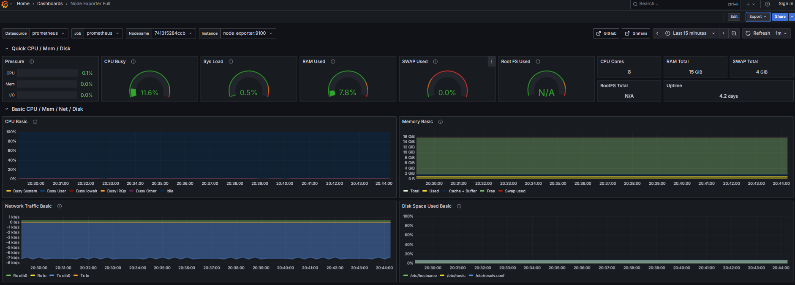
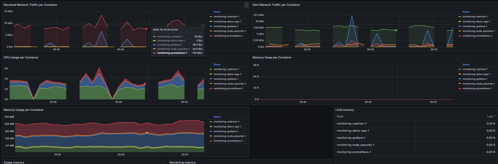

# DevOps
> Practical exercises and tasks related to DevOps principles performed during CSCE certification course. 

## Table of Contents
- [DevOps](#devops)
  - [Table of Contents](#table-of-contents)
  - [Monitoring](#monitoring)

## Monitoring

**Task**

Deploy a Prometheus-based monitoring stack on your system to monitor and visualize different system and application metrics.

**Solution**

1. Docker compose configuration consisting of three services, node exporter (for exposing system/node related metrics), prometheus (metrics scraper) and grafana (visualizer), is available in [monitoring/docker-compose.yml](./monitoring/docker-compose.yml).
2. Deploy all the services using docker-compose:
```bash
$ cd monitoring
$ docker-compose up -d
[+] Running 5/5
 ✔ Network monitoring_default            Created                                                              0.0s 
 ✔ Container monitoring-prometheus-1     Started                                                              0.5s 
 ✔ Container monitoring-node_exporter-1  Started                                                              0.4s 
 ✔ Container monitoring-demo-app-1       Started                                                              0.5s 
 ✔ Container monitoring-grafana-1        Started   
```
3. Verify that the node exporter and cadvisor are exposing system and container metrics respectively:
```bash
$  curl http://localhost:9100/metrics
# HELP go_gc_duration_seconds A summary of the pause duration of garbage collection cycles.
# TYPE go_gc_duration_seconds summary
go_gc_duration_seconds{quantile="0"} 4.5674e-05
go_gc_duration_seconds{quantile="0.25"} 4.5674e-05
go_gc_duration_seconds{quantile="0.5"} 0.000280398
go_gc_duration_seconds{quantile="0.75"} 0.000394249
go_gc_duration_seconds{quantile="1"} 0.000394249
go_gc_duration_seconds_sum 0.000720321
go_gc_duration_seconds_count 3
# output truncated
$ curl http://locahost:8080/metrics
# output omitted
```
4. Open Grafana dashboard at `http://localhost:3000` and configure Prometheus as data source (URL: `http://host.docker.internal:9090`).

5. Create or import Grafana dashboards for basic system and application/container monitoring. Dashboard available in [node-exporter-full.json](./monitoring/node-exporter-full.json) can be imported for monitoring system metrics exposed by the node exporter. If the monitoring stack is running and the Grafana dashboard is configured correctly, the dashboard should look something like this:



6. Since our demo application is running as a docker container, its resource usage metrics can be observed by the metrics being exposed by cadvisor component of the monitoring stack. Dashboard available in [docker-monitoring.json](./monitoring/docker-monitoring.json) can be imported for monitoring container metrics exposed by the cadvisor. If the monitoring stack is running and the Grafana dashboard is configured correctly, the dashboard should look something like this:



> The dasboards used in this task are available on Grafana: [Node Exporter](https://grafana.com/grafana/dashboards/1860-node-exporter-full/), [Docker Monitoring](https://grafana.com/grafana/dashboards/893-main/)   
