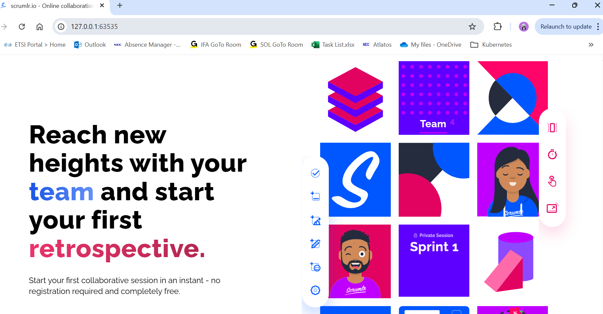

# STACKIT Kubernetes Engine (SKE)
Practical exercises and tasks related to SKE performed during the CSCE certification course.

## Table of Contents
- [STACKIT Kubernetes Engine (SKE)](#stackit-kubernetes-engine-ske)
  - [Table of Contents](#table-of-contents)
  - [Deploying Scrumlr on minikube](#deploying-scrumlr-on-minikube)
  - [SKE infrastructure provisioning using Terraform](#ske-infrastructure-provisioning-using-terraform)

## Deploying Scrumlr on minikube

**Task**

Deploy the Scrumlr application along with necessary components like ingress controller, NATS etc. in a local Kubernetes cluster, such as minikube.

> The Kubernetes manifests, Helm Charts and other configuration files are available in this [Git repository](https://university.git.onstackit.cloud/University/course_deploying_an_application_with_ske.git).

**Solution**

1. Run a minikube cluster and open a tunnel session for the load balancer type of service required for the ingress controller.

```bash
$ minikube start
$ minikube tunnel
✅  Tunnel erfolgreich gestartet

📌  ACHTUNG: Schließen Sie dieses Terminal nicht. Der Prozess muss am Laufen bleiben, damit die Tunnels zugreifbar sind ...
```

2. Clone the code repository and move into the right directory.
```bash
$ git clone https://university.git.onstackit.cloud/University/course_deploying_an_application_with_ske.git
$ cd course_deploying_an_application_with_ske/module3/k8s 
```

3. Add Helm charts to repositories for both ingress controller and NATS instances.

```bash
$ helm repo add ingress-nginx https://kubernetes.github.io/ingress-nginx
$ helm repo add nats https://nats-io.github.io/k8s/helm/charts/
$ helm repo update
```

3. Install ingress controller and 

```bash
# Install ingress-nginx
$ helm upgrade \
  ingress-nginx ingress-nginx/ingress-nginx \
  --install \
  --namespace ingress-nginx \
  --create-namespace \
  --version 4.12.1 \
  --values helm/ingress-nginx/values.yaml

# Install NATS
$ helm upgrade \
  --install \
  nats nats/nats \
  --namespace nats \
  --create-namespace \
  --version 1.3.1 \
  --values helm/nats/values.yaml 
```

4. Generate the key locally for kustomize secretGenerator
```bash
openssl ecparam -genkey -name secp521r1 -noout -out kustomize/scrumlr/jwt.key
```

5. Deploy postgres and scrumlr frontend and backend services using kustomize.
```bash
$ kubectl kustomize kustomize/postgres
$ kubectl kustomize kustomize/scrumlr

# Apply generated Mainfests to the cluster
$ kubectl apply -k kustomize/postgres
$ kubectl apply -k kustomize/scrumlr
```

6. Verify that all services and pods are running.
```bash
$ kubectl get po -A
NAMESPACE       NAME                                       READY   STATUS    RESTARTS   AGE
ingress-nginx   ingress-nginx-controller-b49d9c7b9-4t2zm   1/1     Running   0          13m
kube-system     coredns-668d6bf9bc-74tbr                   1/1     Running   0          16m
kube-system     etcd-minikube                              1/1     Running   0          16m
kube-system     kube-apiserver-minikube                    1/1     Running   0          16m
kube-system     kube-controller-manager-minikube           1/1     Running   0          16m
kube-system     kube-proxy-sqszt                           1/1     Running   0          16m
kube-system     kube-scheduler-minikube                    1/1     Running   0          16m
kube-system     storage-provisioner                        1/1     Running   0          16m
nats            nats-0                                     2/2     Running   0          12m
nats            nats-1                                     2/2     Running   0          12m
nats            nats-2                                     2/2     Running   0          12m
nats            nats-box-8675c8cd65-n695n                  1/1     Running   0          12m
postgres        postgres-scrumlr-0                         1/1     Running   0          12m
scrumlr         scrumlr-backend-7d749bc755-nv7z8           1/1     Running   0          91s
scrumlr         scrumlr-backend-7d749bc755-v5x8w           1/1     Running   0          57s
scrumlr         scrumlr-backend-7d749bc755-vr7z2           1/1     Running   0          46s
scrumlr         scrumlr-frontend-55d9988d98-2qh46          1/1     Running   0          12m
scrumlr         scrumlr-frontend-55d9988d98-b9l9z          1/1     Running   0          12m
scrumlr         scrumlr-frontend-55d9988d98-hftb8          1/1     Running   0          12m
```

7. Get the IP address and check the Scrumlr frontend service via the browser by accessing that IP.
```bash
# Get list of services running in the minikube cluster
$ minikube service list
|---------------|------------------------------------|--------------|-----|
|   NAMESPACE   |                NAME                | TARGET PORT  | URL |
|---------------|------------------------------------|--------------|-----|
| default       | demo-service                       | No node port |     |
| default       | kubernetes                         | No node port |     |
| default       | nginx                              |           80 |     |
| ingress-nginx | ingress-nginx-controller           | http/80      |     |
|               |                                    | https/443    |     |
| ingress-nginx | ingress-nginx-controller-admission | No node port |     |
| kube-system   | kube-dns                           | No node port |     |
| nats          | nats                               | No node port |     |
| nats          | nats-headless                      | No node port |     |
| postgres      | postgres-scrumlr                   | No node port |     |
| scrumlr       | scrumlr-backend                    | No node port |     |
| scrumlr       | scrumlr-frontend                   | No node port |     |
|---------------|------------------------------------|--------------|-----|

$  minikube service ingress-nginx-controller -n  ingress-nginx --url
http://127.0.0.1:63535
http://127.0.0.1:63536
❗  Weil Sie einen Docker Treiber auf windows verwenden, muss das Terminal während des Ausführens offen bleiben.
```

> IMPORTANT: The image used for scruml-backend deployment in the manifests provided by the STACKIT university in their code repository leads to this error: *Failed to pull image "ghcr.io/inovex/scrumlr.io/scrumlr-server:3.10.3": no matching manifest for linux/amd64 in the manifest list entries*, and the corresponding pods never go to the Running state. This is perhaps an issue with this specific version of the image and can be bypassed by using some other working image. I used the latest tag, which corresponds to the one with hash `sha-3001623` listed [here](https://github.com/inovex/scrumlr.io/pkgs/container/scrumlr.io%2Fscrumlr-server/versions). 

8. Open `http://127.0.0.1:63535` in the browser and the following page should be displayed:



## SKE infrastructure provisioning using Terraform

**Task**

Create an SKE cluster using Terraform configuration files for the same Scrumlr deployment as performed on minikube in the previous task, but this time using SKE cluster instead of minikube.

**Solution**

Terraform configuration files for provisioning an SKE cluster(based on stackit terraform provider v0.68.0) are present in the [tf](./tf) directory.

The [main.tf](./tf/main.tf) defines an SKE cluster using the stackit_ske_cluster resource. Below is the breakdown of its contents:
- **Stackit Provider configuration**: Configures the STACKIT provider, its correct version, default_region and the service account key.
- **Cluster basic configuration:** The STACKIT project ID is passed via a variable declared in the variables.tf which can be assigned in terraform.tfvars (usually behind .gitignore). kubernetes_version_min ensures that the cluster runs at least Kubernetes version 1.34.1.
- **Node Pool configuration:** This block configures a single-node pool with the name "scrumlrpool". The number of nodes in the pool is defined in the "minimum" and "maximum" fields. A higher maximum value can be used to enable node autoscaling. This example uses 3 nodes because the Scrumlr and NATS workloads run 3 replicas each, which can be spread across different nodes using [Pod Topology Spread Constraints](https://kubernetes.io/docs/concepts/scheduling-eviction/topology-spread-constraints/).
- **Maintenance Window configuration:** This enables auto-updates for for Kubernetes and OS images during the specified 1-hour window between 01:00 and 02:00 UTC.
- **DNS Extension configuration:** This configures the DNS zone for the Scrumlr deployment.

Follow the provisioning steps below to create the SKE cluster using Terraform:
1. Assign the values to the Terraform variables `service_account_key`, `project_id` and `dns_name` using `.tfvars` file or via environment variables. 
2. Run `terraform init` to initiate the STACKIT provider.
3. Run `terraform plan` to see and investigate which resources will be created using the given configurations. Make changes in the configuration files if needed.
4. Run `terraform apply` and press y/Y to confirm provisioning of the desired SKE infrastructure.


> Disclaimer: The actual SKE cluster provisioning hasn't been verified due to the limitation of not having a STACKIT customer account to generate the required service account key. However, the configuration files provided in the [tf](./tf/) directory should work if the user can create the service account and its key using STACKIT portal.