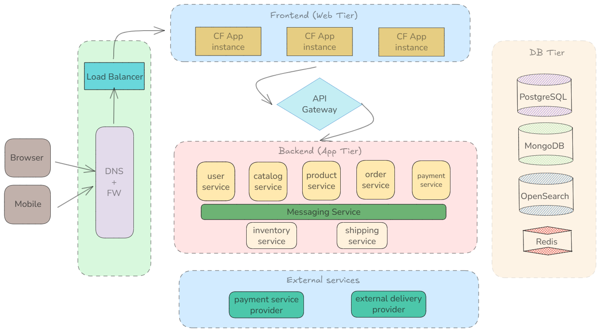

# Solution Architecture (E-Commerce)

**Task**

Design a microservice architecture for an online shop using various STACKIT PaaS components with a strong focus on the following aspects:
- Understand how different PaaS services work together in a modern application architecture
- Identify suitable use cases for container, app deployment, and managed service solutions
- Apply best practices for scalability, availability, and security

**Solution**

The solution architecture is divided in the following parts:

- [Solution Architecture (E-Commerce)](#solution-architecture-e-commerce)
  - [Part 1: Requirements Analysis](#part-1-requirements-analysis)
  - [Part 2: Service Identification](#part-2-service-identification)
  - [Part 3: Technology Selection](#part-3-technology-selection)
  - [Part 4: Architecture Diagram](#part-4-architecture-diagram)
    - [Frontend (Web Tier)](#frontend-web-tier)
    - [API Gateway](#api-gateway)
    - [Backend (App Tier)](#backend-app-tier)
    - [DB Tier](#db-tier)
    - [Messaging](#messaging)
    - [External Services](#external-services)
    - [User Story](#user-story)
  - [Part 5: Key Aspects and Explanation](#part-5-key-aspects-and-explanation)
    - [PaaS solution choices](#paas-solution-choices)
    - [Advantages and Disadvantages](#advantages-and-disadvantages)
    - [Scalability and Availability](#scalability-and-availability)
    - [Security and Observability](#security-and-observability)
   

## Part 1: Requirements Analysis

The requirements for the online shop, its components and services are as follows:
- Catalog with products and categories
- User management and authentication
- Shopping cart functionality
- Order processing and payment processing
- Product search with filtering and faceting
- Real-time inventory management

There may be additional components covered in this proposed solution to provide a comprehensive architecture.

## Part 2: Service Identification

*Microservices*

Following microservices are identified to provide the minimal functionality per desired requirements:
- Catalog service: provides a catalog of all products and their categories
- User service: manages user account management and authentication
- Product service: provides search functionality over all the products available in the catalog
- Order service: provides shopping cart functionality and lets users place their orders 
- Payment service: processes payments once the order has been placed and can interact with external 3rd party payment service providers
- Shipping service: internal service for shipment and dispatch of paid-for orders
- Inventory service: maintains real-time inventory of all the products

> The above is a non-exhaustive list, there are in fact many other services in a complete e-commerce solution.

*Which functions should be implemented as separate services?*

The online store functionality should have at least the following split:
- **User-facing functionality:** user management, product searching, order placement, check out and payment.
- **Internal functionality:** processing shipment and tracking inventory.

The above two categories can further be splitted into different business domains based on enterprise operations and company departments etc. Splitting the above two categories into individual microservices (as shown above) can lead to further decoupling, accelerated innovation, clear domain boundaries, agile development and feature rollout etc.

*Data stores*

- **Catalog service** makes use of a document database like **MongoDB** to account for different kinds of products offering schema flexibility.
- **User service** uses **PostgreSQL** for data consistency, ACID guarantees and keeping relational data associated with users like their profile info, order history etc. 
- **Product service** makes use of **Opensearch database** and its search functionality for finding the desired product items.
- **Payment service** can make use of in-memory data store like **Redis** for quick and short-term caching of payment information while making the necessary external interactions with payment service providers. Long-term information about users' payment options and preferences should be stored in the PostgreSQL database.
- **Shipping service** makes use of **PostgreSQL** database for ACID and data consistency.
- **Inventory service** makes use of **PostgreSQL** database for ACID and data consistency.

*Communication*

- Backend services that provide customer-facing functionality expose REST APIs on their North-Bound Interface (NBI).
- For east-west communication between different microservices, a messaging service is used for internal coordination and communication.

## Part 3: Technology Selection

Runtime (deployment) and PaaS solutions for each tier and services are chosen as below:
- Web Tier (Frontend): Auto-scaling enabled **Cloud Foundry** instances across multiple AZs for high-availability, service quality and fault redundancy
- App Tier (Backend): Backend services deployed on **SKE** with multi-AZ nodes to leverage auto-scaling, auto-healing and service exposure functionalities offered by Kubernetes
- DB Tier: **Postgres, MongoDB** and **Redis**
- Search: **OpenSearch** for product service
- Messaging: **RabbitMQ** for event-driven inter-service communication
- Observability: *[TBD]*
- ...
  
> Above is a non-exhaustive list of STACKIT technologies and offerings that cover the core components of this e-commerce solution as per its minimal desired requirements.

## Part 4: Architecture Diagram

High level reference architecture for this e-commerce solution is provided below:

### Frontend (Web Tier)

The web-based frontend is deployed as Cloud Foundry instances for ease of deployment and auto-scaling based on user traffic. An application load balancer can be used to balance incoming requests among active instances.

### API Gateway

Gateway between web-based frontend/mobile apps and backend services exposing REST APIs for different functionalities of the online store. 

Load balancing is also introduced here to balance load between different active instances of backend services.

### Backend (App Tier)

The backend microservices are deployed and exposed using Kubernetes resources on SKE with worker nodes deployed across multiple availability zones.

User facing services (like user, product, order, payment etc.) expose REST APIs via the API Gateway. These services also publish events on the messaging service for event-driven communication between the backend services

Each backend service also interacts with its respective data store / database in the DB tier.

### DB Tier

The DB tier consists of databases and data stores required for the backend services. These services connect with their respective DBs via dedicated connections.

### Messaging

RabbitMQ is used as the messaging service for event-driven communication between different backend services.

### External Services

Relevant backend services like payment, shipping etc. may need to interact with external 3rd party services, e.g., payment providers, delivery partners etc. 

### User Story

The design and functionality of the proposed e-commerce solution can be explained by the following user story:

1. A web user accesses the online shop using the browser and accesses webpages served by the frontend services.
2. The user logs into the portal using their account credentials. This login service is provided by the user service which, in case of a successful login, fetches user data such has their profile info, order history etc. from the PostgrSQL database.
3. The user can see all the products on the website served by the catalog service, which accesses them from the MongoDB database.
4. The user searches for the desired product on the website and finds it owing to the search results provided by the product service. The product service makes use of Opensearch data store and its search functionality to find the desired product.
5. The user adds the desired product to the shopping cart, a functionality provided by the order service. The dynamic state of the cart is stored in a Redis cache till the checkout process has been completed. PostgreSQL can be used if user's shopping cart needs to be persisted even after the current session. 
6. The user completes their order by checking out the items in their cart. At this stage, the user is redirected to the payment service.
7. The payment service may interact with external payment providers for processing the payment. Once the payment has been successfully completed, the user is notified of their order completion. At the same time, an event is also generated by the payment service and published on the messaging service indicating successful payment.
8. The shipping service listens to the 'payment successful' event and starts processing the shipment.
9. Once the shipment has been processed, corresponding events on the message bus are published by the shipping service.
10. Upon receiving the message about succesful shipment of the product/item, the inventory service updates the product/item inventory in the database with the new number of available items.
11. The catalog service updates its catalog of available products and items in its data store based on the updated inventory.

## Part 5: Key Aspects and Explanation

### PaaS solution choices

STACKIT's Cloud Foundry is chosen for frontend components for ease of deployment, stateless nature of the workload and to ensure autoscaling as demand/traffic increases using the seamless autoscaling feature of Cloud Foundry.

STACKIT Kubernetes Engine (SKE) is used for deployment of backend microservices as Kubernetes resources for a more organized approach. Different microservices rely on each other for the complete functionality of the online store. Opting for Kubernetes as their deployment model can offer many benefits like:
- Coordinated orchestration of all backend microservices
- Combined packaging and unified deployments using Helm charts
- Potential to leverage the security, observability, service mesh solutions in the Kubernetes ecosystem like cert-manager, Istio, Prometheus etc.

Managed PostgreSQL is used for storing data that requires consistency and ACID guarantees like user profiles, order history, shipping status etc.

Managed MongoDB service is used for keeping the diverse product catalogue in a documents database to deal with heterogenous schema.

OpenSearch service is used for providing users with the product searching functionality. 

Managed Redis service is used for caching short-term data with no strong consistency and persistency requirements.

Managed RabbitMQ is used for the messaging service.

### Advantages and Disadvantages

**Advantages**
- Scalability
- High availability
- Redundancy
- Modular design (microservices)
- REST-based NBIs for clean API contract and transactions
- Asynchronous communication for event-driven communication between microservices
- Purpose-specific choice of databases

**Disadvantages**
- Lack of uniformity in deployment models for frontend and backend services 
- Complexity associated with combining both REST based and asynchronous communication
- Lacking non-functional details (observability, performance, security) *[TBD]*

### Scalability and Availability

**Scalability**
The frontend services can be scaled horizontally using an on-demand, autoscaling-enabled serverless deployments/functions depending on the traffic capacity of the online store.

As a starting point, Cloud Foundry instances or even deploying frontend components on SKE using K8s resources can also offer solid scalability.  

Same goes for the backend services. Microservices pattern is used to design and develop backend services that are then deployed on Kubernetes for future-proof scalability. 

**Availability**

Multiple instances of frontend and backend services deployed across multiple availability zones offered by the STACKIT Cloud provider can ensure high-availabilty, service assurance, geo-redundancy and fault tolerance.

### Security and Observability
*TBD*